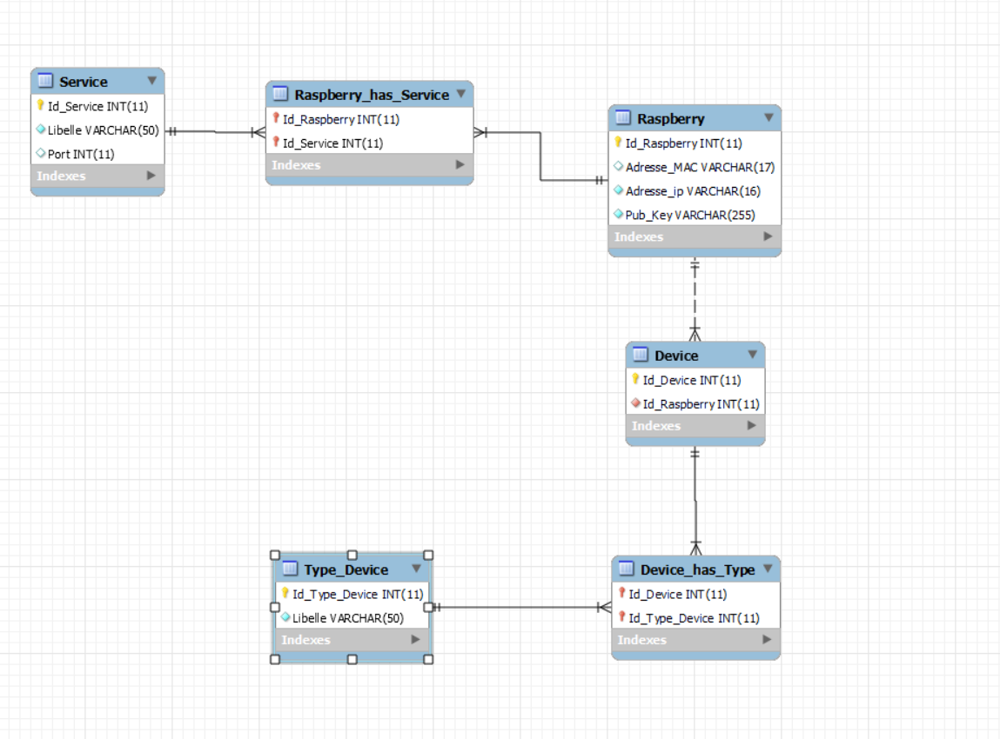

# airlux
projet M1 airlux IoT.
Le projet vise a mettre en place tous les composants d'un system IoT pour moderniser les produits de la société Airlux.

### schéma d'architecture:

## public server: 
api en FastAPI (python)
handshake avec les raspberry pi chez les gens pour récupérer l'adresse ip et la donner a traefik pour créer le tunnel rssh
airnet private server aussi
BDD mysql

## reverse proxy:
traefik (sur le meme réseau que le public server)
il permettra aux utilisateurs de controler les devices chez eux depuis l'extérieur sans avoir a port-forward

## raspberry pi:
quand elle démarre, envoie son adresse mac, ip et clé publique lors du premier démarrage a l'api publique pour pouvoir créer la connexion rssh
puis ping toutes les 5min

write behind pattern https://redis.io/learn/howtos/solutions/caching-architecture/write-behind

### Modèle de données:

# comment déployer le projet
sur windows: installer docker desktop puis cloner le repository

faire in git clone de https://github.com/guillaumevern/airlux

se positionner dans le dossier `public-server`
`docker compose up -d`

se positionner dans le dossier `NAT`
`docker compose up -d`